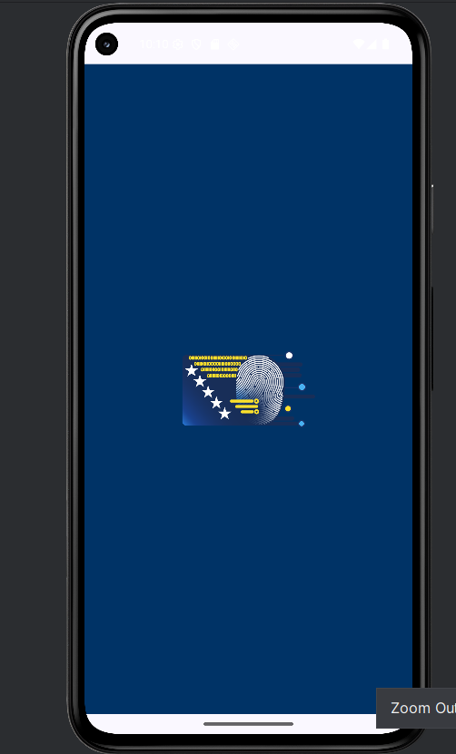
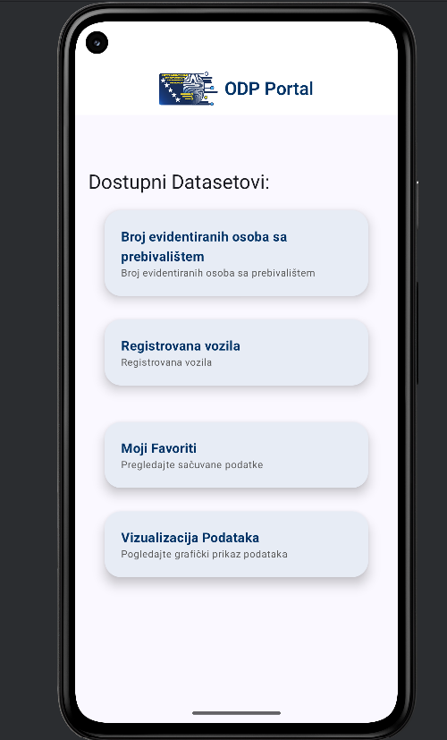
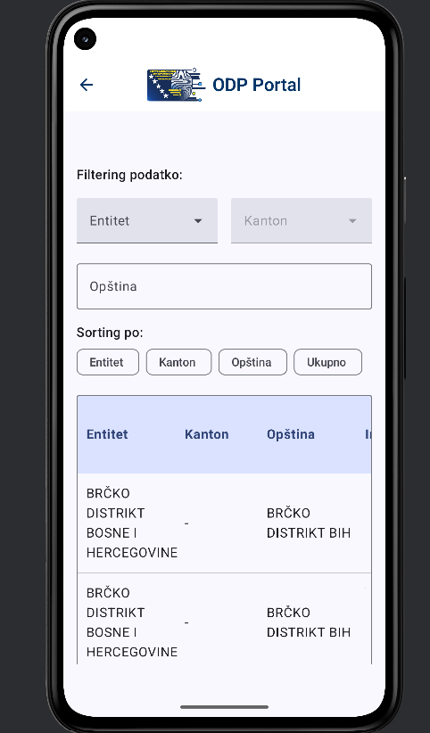
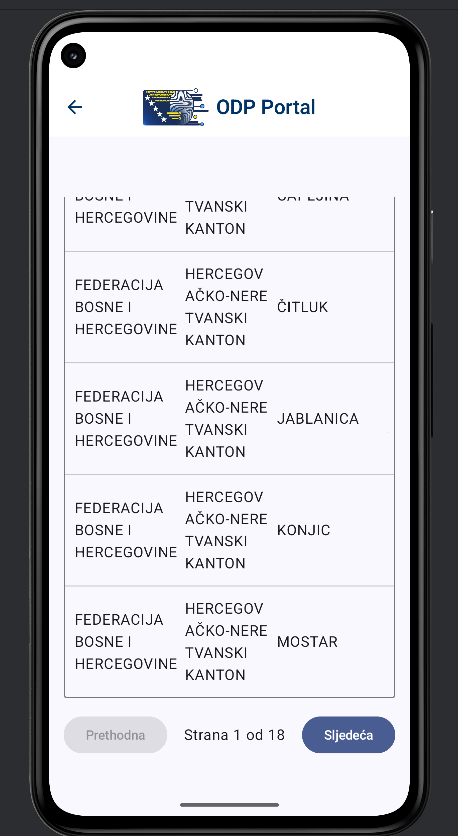
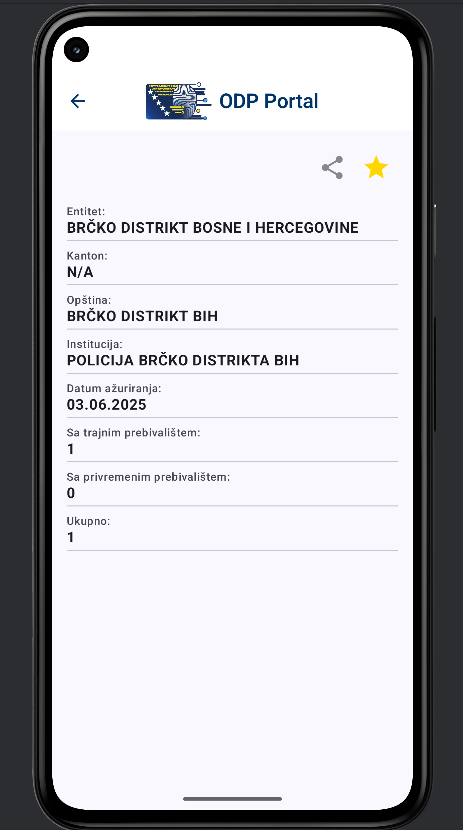
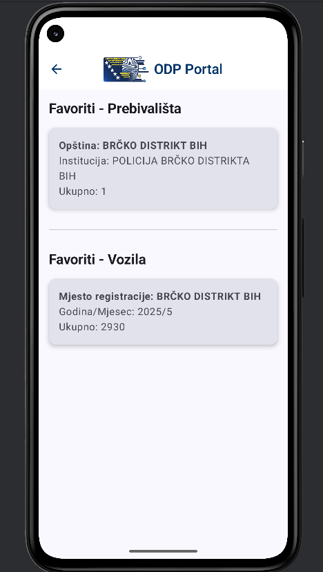
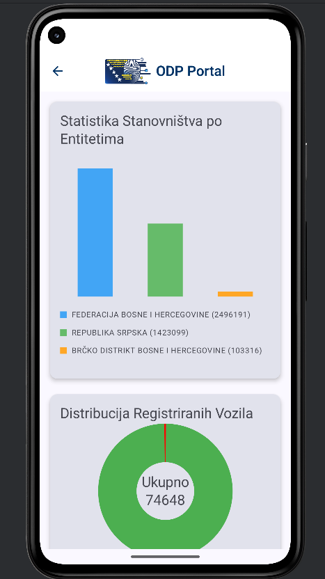
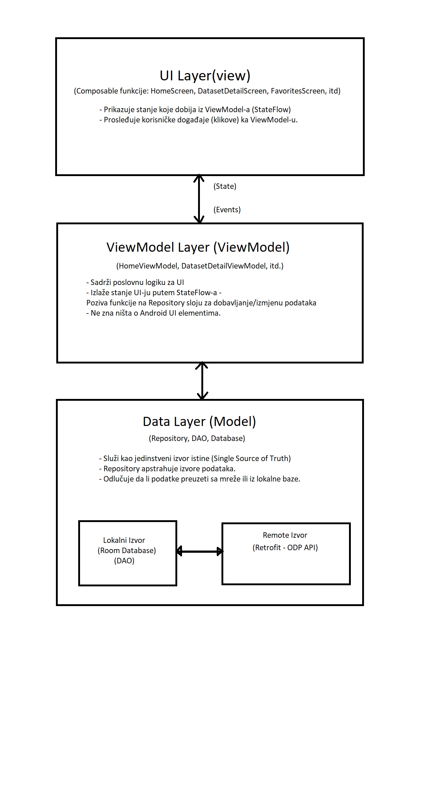

# Uvod i Opis Aplikacije

ODP App je Android aplikacija razvijena sa ciljem da korisnicima omogući jednostavan pregled, filtriranje i analizu podataka sa portala otvorenih podataka Agencije za identifikaciona dokumenta, evidenciju i razmjenu podataka Bosne i Hercegovine (IDDEEA). Aplikacija služi kao mobilni klijent koji preuzima, lokalno skladišti i vizualizuje odabrane setove podataka, pružajući bogato korisničko iskustvo i offline funkcionalnost.

Glavni ciljevi aplikacije su:

* Pružiti brz i pregledan pristup javnim podacima.
* Omogućiti moćne alate za filtriranje, sortiranje i pretragu podataka.
* Vizualizovati podatke kroz interaktivne grafikone.
* Omogućiti korisnicima da sačuvaju interesantne stavke za kasniji pregled.
* Obezbediti funkcionalnost i u uslovima bez internet konekcije, prikazujući prethodno sačuvane (keširane) podatke.

## Funkcionalni pregled ekrana

Aplikacija se sastoji od nekoliko ključnih ekrana koji zajedno čine celovito korisničko iskustvo.

#### Splash Screen

Prvi ekran koji korisnik vidi pri pokretanju. Njegova svrha je da prikaže logo i naziv aplikacije dok se u pozadini inicijalizuju osnovne komponente. Nakon dve sekunde, korisnik se automatski preusmerava na početni ekran.

#### Home Screen (Početni ekran)

Centralni ekran aplikacije koji služi kao glavna tačka navigacije. Na njemu se nalazi lista dostupnih setova podataka (dataset-ova) koje aplikacija podržava. Trenutno su to:

* Broj evidentiranih osoba po prebivalištu.
* Broj registrovanih vozila.

Pored toga, na ovom ekranu se nalaze i kartice za navigaciju ka dodatnim funkcionalnostima:

* Moji Favoriti: Vodi na ekran sa svim sačuvanim stavkama.
* Vizualizacija Podataka: Vodi na ekran sa grafičkim prikazima podataka.

#### Dataset Detail Screen (Ekran sa detaljima dataseta)

Ovo je najkompleksniji ekran u aplikaciji. Kada korisnik odabere jedan od dataseta sa početnog ekrana, otvara se ovaj ekran koji prikazuje podatke u tabelarnoj formi. Njegove ključne funkcionalnosti su:

* Filtriranje: Korisnik može filtrirati podatke po entitetu, kantonu i pretraživati opštine po nazivu.
* Sortiranje: Klikom na čipove za sortiranje, podaci se mogu sortirati po različitim kolonama (npr. po entitetu, opštini, ukupnom broju) u rastućem ili opadajućem redosledu.
* Paginacija: Ako postoji veliki broj redova, podaci su podeljeni na stranice radi bolje preglednosti.
* Offline podrška: Prilikom prvog ulaska, podaci se preuzimaju sa mreže i keširaju u lokalnu bazu. Svaki sledeći put, podaci se trenutno prikazuju iz baze, a u pozadini se pokušava osvežavanje.

#### Dataset Row Detail Screen (Ekran sa detaljima reda)

Kada korisnik klikne na jedan red u tabeli na prethodnom ekranu, otvara se ovaj ekran koji prikazuje sve dostupne informacije za tu konkretnu stavku na pregledan način.
Funkcionalnosti ovog ekrana su:

* Dodavanje u favorite: Korisnik može označiti stavku kao favorita klikom na ikonicu zvezdice.
* Deljenje: Korisnik može podeliti formatirane podatke o toj stavci putem drugih aplikacija (email, poruke, društvene mreže).

#### Favorites Screen (Ekran sa favoritima)

Na ovom ekranu su izlistane sve stavke koje je korisnik prethodno označio kao favorite. Podeljene su u dve sekcije: Prebivališta i Vozila. Klikom na bilo koju stavku, korisnik se vraća na Dataset Row Detail Screen za tu stavku.

#### Statistics Screen (Ekran za statistiku)

Ovaj ekran pruža vizuelni uvid u podatke kroz grafikone.

* Bar Chart (Stubičasti dijagram): Prikazuje ukupan broj stanovnika po entitetima.
* Donut Chart (Prstenasti dijagram): Prikazuje distribuciju registrovanih vozila na domaća i strana.
  Ovaj ekran demonstrira kako se sirovi podaci mogu transformisati u smislene vizualizacije.

## Arhitektura Aplikacije

Aplikacija je izgrađena prateći preporučenu modernu Android arhitekturu, zasnovanu na MVVM (Model-View-ViewModel) obrascu. Ova arhitektura promoviše odvajanje odgovornosti (separation of concerns), što čini kod organizovanijim, lakšim za testiranje i održavanje.

Arhitektura se sastoji od tri ključna sloja:

* UI Layer (View): Prikazni sloj.
* ViewModel Layer (ViewModel): Sloj koji upravlja stanjem i logikom za UI.
* Data Layer (Model): Sloj za upravljanje podacima.

#### Dijagram Komponenti

#### Tok podataka i događaja

* Tok podataka (State Flow): Podaci teku jednosmerno, od vrha ka dnu. Repository dobavlja podatke iz baze ili sa mreže. ViewModel ih preuzima, obrađuje i transformiše u UI State (stanje za prikaz). UI (Composable funkcije) se pretplaćuje na taj State i samo ga prikazuje.
* Tok događaja (Event Flow): Događaji teku u suprotnom smeru, od dna ka vrhu. Kada korisnik izvrši akciju (npr. klikne na dugme), UI obaveštava ViewModel o tom događaju. ViewModel zatim odlučuje kako da obradi događaj – da li da promeni lokalno stanje, pozove Repository da ažurira podatke, itd.

Ovaj jednosmerni tok podataka (Unidirectional Data Flow - UDF) je ključan za predvidljivost i stabilnost aplikacije.

## Opis Ključnih Klasa

#### ViewModels

ViewModels su srce poslovne logike za svaki ekran.

* class HomeViewModel(private val odpRepository: OdpRepository)

  * Odgovornost: Upravlja stanjem HomeScreen-a. Glavni zadatak mu je da od OdpRepository-ja dobavi listu dostupnih dataseta i prikaže je korisniku. Stanje izlaže kao StateFlow<HomeUiState>.
* class DatasetDetailViewModel(savedStateHandle: SavedStateHandle, ...)

  * Odgovornost: Najkompleksniji ViewModel. Upravlja stanjem DatasetDetailScreen-a.
  * Koristi SavedStateHandle da bi dobio id dataseta iz navigacije na siguran način.
  * Implementira offline-first logiku: init blok pokreće posmatranje lokalne baze i sinhronizaciju sa mrežom.
  * Izlaže StateFlow<DatasetDetailUIState> koji sadrži sve podatke o stanju ekrana, uključujući listu podataka, stanje filtera, sortiranja, paginacije i grešaka.
  * Sadrži funkcije (onSortChanged, onFilterChanged, itd.) koje UI poziva da bi prijavio korisničke događaje.
* class DatasetRowDetailViewModel(savedStateHandle: SavedStateHandle, ...)

  * Odgovornost: Upravlja stanjem ekrana za prikaz detalja jednog reda.
  * Koristi SavedStateHandle da dobije entityType i entityId.
  * Dobavlja podatke za taj specifičan entitet iz repozitorijuma.
  * Upravlja stanjem "favorita" za tu stavku, omogućavajući dodavanje i uklanjanje.
* class FavoritesViewModel(favoritesRepository: FavoritesRepository)

  * Odgovornost: Pribavlja liste sačuvanih favorita (i prebivališta i vozila) iz FavoritesRepository-ja i izlaže ih FavoritesScreen-u.
* class StatisticsViewModel(residenceRepository: ResidenceRepository, ...)

  * Odgovornost: Transformiše sirove podatke u podatke pogodne za vizualizaciju.
  * Koristi combine operator na Flow-ovima iz dva različita repozitorijuma (residenceRepository i vehicleRepository) da bi kreirao jedinstveno stanje za StatisticsScreen. Ovo je odličan primer reaktivnog programiranja.

#### Repozitorijumi

Repozitorijumi su deo Data sloja i služe kao apstrakcija nad izvorima podataka.

* class NetworkOdpRepository(private val apiService: ApiService, ...)

  * Odgovornost: Glavni repozitorijum za podatke aplikacije. ViewModel komunicira sa njim, a on odlučuje odakle će povući podatke.
  * Metode kao što su getResidenceData i getVehiclesData prvo pozivaju ApiService da dobave podatke sa mreže, a zatim te podatke upisuju u lokalnu bazu (keširanje) ako je ona prazna.
* class OfflineFavoritesRepository(private val favoriteResidenceDao: FavoriteResidenceDao, ...)

  * Odgovornost: Upravlja svim operacijama vezanim za favorite – dodavanje, brisanje, dobavljanje svih favorita i provera da li je određena stavka favorit. Komunicira isključivo sa DAO objektima za favorite.

#### DAO (Data Access Objects)

DAO objekti su interfejsi koji definišu kako aplikacija komunicira sa Room bazom.

* interface ResidenceDao, interface VehicleDao, itd.
  * Odgovornost: Sadrže metode za pristup bazi podataka.
  * @Query("SELECT ...") fun getAll(): Flow<List<...>>: Metode koje čitaju podatke vraćaju Flow. Ovo omogućava da ViewModel reaktivno sluša promene u bazi i automatski ažurira UI.
  * @Insert suspend fun insertAll(...): Metode koje vrše upis (ili brisanje/ažuriranje) su suspend funkcije, što znači da se moraju pozivati iz korutine, osiguravajući da se operacije na disku ne izvršavaju na glavnoj (UI) niti.

## Korišteni Koncepti i Biblioteke

#### Room Database

Room je apstrakcioni sloj (ORM - Object Relational Mapper) preko SQLite baze podataka. On pojednostavljuje rad sa bazom i obezbeđuje proveru upita tokom kompajliranja.

* @Entity: Anotacija koja se koristi na data klasama (ResidenceEntity, VehicleEntity) da bi se označile kao tabele u bazi.
* @Dao: Anotacija za interfejse koji definišu upite nad bazom.
* @Database: Anotacija za glavnu klasu baze (AppDatabase) koja definiše koje entitete sadrži i koja DAO obezbeđuje. U vašem projektu, baza sadrži tabele za podatke i za favorite.

#### ViewModel

ViewModel je komponenta iz Jetpack biblioteke dizajnirana da čuva i upravlja podacima vezanim za UI na način koji je svestan životnog ciklusa.

* Preživljavanje promena konfiguracije: Glavna prednost ViewModel-a je što ne biva uništen prilikom rotacije ekrana, za razliku od Activity-ja ili Composable funkcija. Ovo sprečava gubljenje stanja i potrebu za ponovnim učitavanjem podataka.
* viewModelScope: Svaki ViewModel ima ugrađen CoroutineScope pod nazivom viewModelScope. Sve korutine pokrenute u ovom opsegu se automatski otkazuju kada se ViewModel uništi, što sprečava curenje memorije.
* SavedStateHandle: Kao što je implementirano u DatasetDetailViewModel, SavedStateHandle omogućava ViewModel-u da primi argumente iz navigacije i da sačuva jednostavno stanje, čineći ga otpornim i na gašenje procesa aplikacije od strane sistema.

#### Upravljanje stanjem u Compose (State Management)

Compose je deklarativni UI framework, što znači da opisujete kako UI treba da izgleda za određeno stanje.

* State i remember: State<T> je tip koji drži vrednost i obaveštava Compose kada se ta vrednost promeni, kako bi se UI ponovo iscrtao (recomposition). remember se koristi da bi se vrednost sačuvala kroz proces rekompozicije.
* rememberSaveable: Slično kao remember, ali dodatno čuva stanje i nakon promena konfiguracije (npr. rotacije ekrana) tako što ga upisuje u Bundle.
* Podizanje stanja (State Hoisting): Princip po kojem se stanje "podiže" sa nižih (child) Composable funkcija na više (parent) nivoe. U našem projektu, stanje filtera i sortiranja je na kraju podignuto sa DatasetDetailScreen-a u DatasetDetailViewModel, što je najbolja praksa za kompleksna stanja.
* StateFlow: "Vrući" Flow koji je idealan za predstavljanje stanja u ViewModel-u. UI se na njega pretplaćuje koristeći collectAsState() i automatski se ažurira pri svakoj promeni.

#### Coroutines i Flow

Coroutine (korutine) su osnova za asinhrono programiranje u modernom Androidu.

* Asinhronost: Omogućavaju da se dugotrajne operacije (mreža, disk) izvršavaju u pozadini bez blokiranja glavne niti.
* suspend funkcije: Ključna reč koja označava da funkcija može biti pauzirana i nastavljena kasnije. Sve vaše mrežne i DAO write operacije su suspend.
* Flow: Tok podataka koji može emitovati više vrednosti sekvencijalno. U projektu se koristi za dobijanje podataka iz Room baze. Kada se podaci u bazi promene, Flow automatski emituje novu listu podataka svima koji ga slušaju, čineći aplikaciju reaktivnom.

#### Retrofit

Retrofit je HTTP klijent za Android i Javu koji olakšava komunikaciju sa REST API-jima.

* ApiService interfejs: Definisali ste ovaj interfejs sa anotacijama (@POST, @Body, @Url) koje opisuju kako treba da izgledaju HTTP zahtevi ka ODP API-ju.
* Konverter: Koristite kotlinx.serialization konverter (asConverterFactory) koji automatski pretvara JSON odgovore sa servera u vaše Kotlin data klase (ApiResponse, ResidenceApiResponse, itd.).

#### Navigacija u Compose (Navigation Compose)

Ova biblioteka omogućava navigaciju između Composable funkcija.

* NavController: Centralna komponenta koja upravlja navigacijom.
* NavHost: Composable funkcija koja definiše grafikon navigacije, odnosno povezuje rute (stringove) sa Composable destinacijama.
* Prosleđivanje argumenata: Kao što je implementirano, argumenti se mogu prosleđivati kao deo rute (npr. datasetDetails/{id}), što omogućava kreiranje dinamičkih destinacija i deep-linkinga.

Material 3 Theming

Aplikacija koristi Material 3, najnoviju verziju Google-ovog dizajn sistema.

* Theme.kt: Centralni fajl za temu aplikacije. Definiše palete boja za svetlu i tamnu temu (lightColorScheme, darkColorScheme) i tipografiju.
* Dinamičke boje (Dynamic Colors): Aplikacija podržava dinamičke boje na Androidu 12+, gde se paleta boja aplikacije automatski prilagođava pozadini telefona korisnika.
* Komponente: Sve UI komponente (Card, Button, Scaffold...) su iz material3 paketa, što osigurava konzistentan i moderan izgled.
